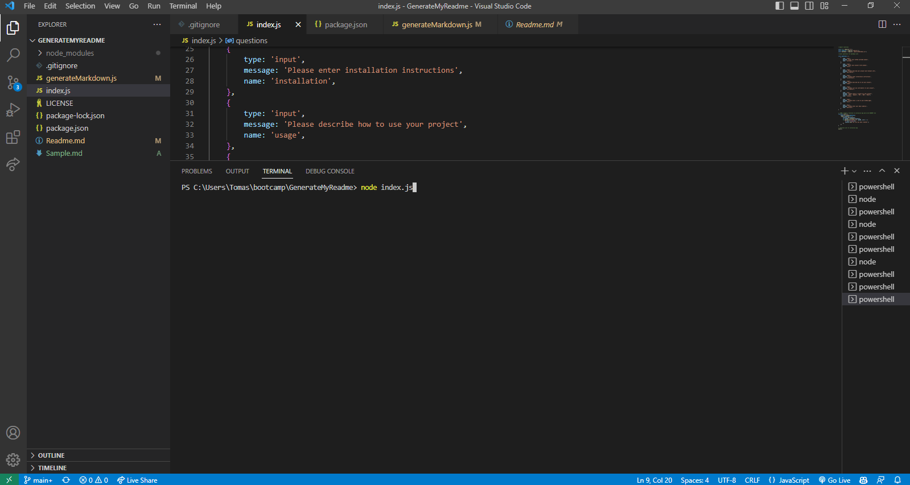

# Professional ReadMe Generator
# Table of Contents
[Description](#description)

[Installation](#installation)

[Usage](#usage)

[Contributors](#contributors)

[License](#license)

[Tests](#tests)

[Questions](#questions)

## Description
This is a ReadMe Generator I created which runs through Node. Through creating this project I found a great way to automatically create and format an important part to every repo. I learned a lot about using various native and non-native Node libraries. By using this script, I can create a very nice looking ReadMe file to use in every situation.

## Installation
Once you have a clone of the repo, open the internal terminal of VS code and run npm install. This will install the inquirer library which you will need.

## Usage
Once inquirer is installed, through the terminal again, run 'node index.js'. Now you will be asked questions in regards to your ReadMe file. Follow along and answer as best as you can. The Test section only requires your GitHub name, the link will appear by default.

.

A sample video link can be found here:
https://drive.google.com/file/d/1J-aEl_1VGtkuBwpV1xPtDO4KTc4iqvON/view?usp=sharing

## Contributors
This repo is solely my own creation, Tamas Pinter

## License

https://opensource.org/licenses/MIT 

Copyright Permission is hereby granted, free of charge, to any person obtaining a copy of this software and associated documentation files (the "Software"), to deal in the Software without restriction, including without limitation the rights to use, copy, modify, merge, publish, distribute, sublicense, and/or sell copies of the Software, and to permit persons to whom the Software is furnished to do so, subject to the following conditions: 

The above copyright notice and this permission notice shall be included in all copies or substantial portions of the Software.

THE SOFTWARE IS PROVIDED "AS IS", WITHOUT WARRANTY OF ANY KIND, EXPRESS OR IMPLIED, INCLUDING BUT NOT LIMITED TO THE WARRANTIES OF MERCHANTABILITY, FITNESS FOR A PARTICULAR PURPOSE AND NONINFRINGEMENT. IN NO EVENT SHALL THE AUTHORS OR COPYRIGHT HOLDERS BE LIABLE FOR ANY CLAIM, DAMAGES OR OTHER LIABILITY, WHETHER IN AN ACTION OF CONTRACT, TORT OR OTHERWISE, ARISING FROM, OUT OF OR IN CONNECTION WITH THE SOFTWARE OR THE USE OR OTHER DEALINGS IN THE SOFTWARE. 
 

## Tests
You can find my Repo @ https://www.github.io/TamasPinter

## Questions
If you have any questions please feel free to email me: brolli_673@hotmail.com